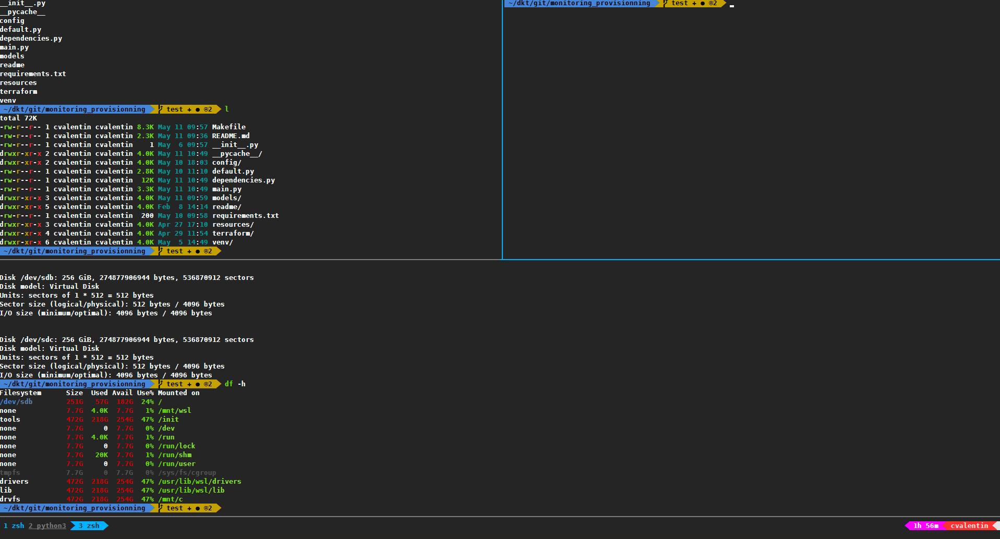
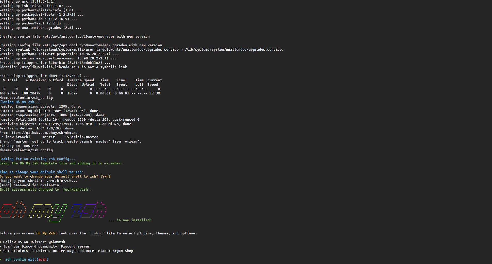

# zsh_config

## Software

- Tmux (with CTRL + B to CTRL + A switch)
- Oh My Tmux
- ZSH with multiple plugin
- Zgen (Package manager for ZSH)
- Oh My ZSH
- PowerLine font (Droid Sans Mono for Powerline Nerd Font Complete.otf)
- GRC (Add color)



## Install :
```
chmod +x install.sh
./install.sh
```  

When Oh-My-ZSH boot, leave current session (CTRL + D) to continue install.



Restart your terminal to finish install

***Don't forget to use font *Droid Sans Mono for Powerline Nerd Font Complete.otf* in your terminal config***

For Windows user you can download/install font [here](https://github.com/ryanoasis/nerd-fonts/tree/master/patched-fonts/DroidSansMono/complete)

# Enjoy
